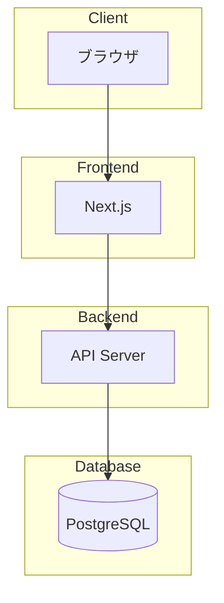
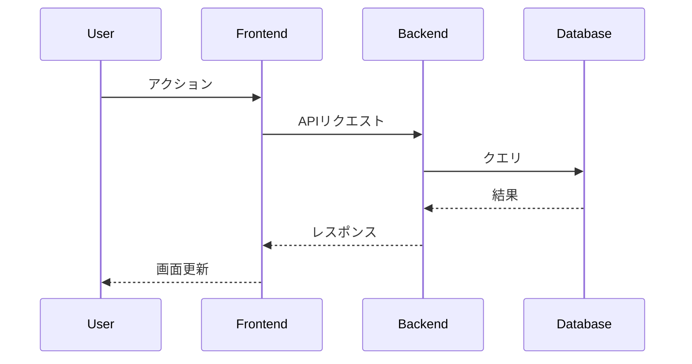

# アーキテクチャ設計書

## 1. システム構成図



## 2. 技術スタック

### フロントエンド
| 技術 | バージョン | 用途 |
|------|-----------|------|
| Next.js | 15.x | フレームワーク |
| TypeScript | 5.x | 型システム |
| Tailwind CSS | 3.x | スタイリング |

### バックエンド
| 技術 | バージョン | 用途 |
|------|-----------|------|
| [技術名] | [バージョン] | [用途] |

### インフラ
| 技術 | 用途 |
|------|------|
| [技術名] | [用途] |

## 3. ディレクトリ構造

```
[プロジェクトのディレクトリ構造]
```

## 4. 主要コンポーネント

### [コンポーネント名1]
- **責務**: [このコンポーネントが担う役割]
- **依存**: [依存するコンポーネント]
- **インターフェース**: [公開するAPI/メソッド]

### [コンポーネント名2]
- **責務**: [このコンポーネントが担う役割]
- **依存**: [依存するコンポーネント]
- **インターフェース**: [公開するAPI/メソッド]

## 5. データフロー



## 6. セキュリティ設計

### 認証・認可
- 認証方式: [JWT / Session / OAuth等]
- 認可モデル: [RBAC / ABAC等]

### データ保護
- 通信: HTTPS
- 保存データ: [暗号化方式]
- 機密情報: [管理方法]

## 7. エラーハンドリング方針

### フロントエンド
| エラー種別 | 対応方法 | ユーザーへの表示 |
|------------|----------|-----------------|
| ネットワークエラー | リトライ | 「接続に失敗しました」 |
| バリデーションエラー | フォーム表示 | フィールド下にメッセージ |
| 予期しないエラー | エラーバウンダリ | エラーページ |

### バックエンド
| エラー種別 | HTTPステータス | レスポンス |
|------------|---------------|-----------|
| バリデーションエラー | 422 | 詳細なエラー情報 |
| 認証エラー | 401 | Unauthorized |
| 権限エラー | 403 | Forbidden |
| サーバーエラー | 500 | 汎用メッセージ |
