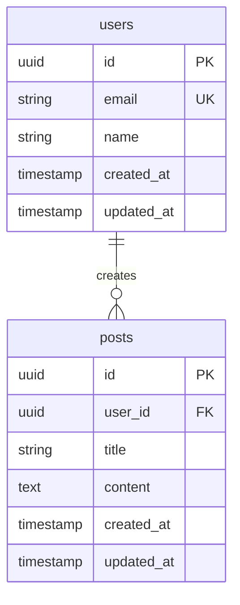

# データベース設計書

## ER図

## テーブル定義

### users
ユーザー情報を管理するテーブル

| カラム | 型 | 制約 | 説明 |
|--------|-----|------|------|
| id | UUID | PK | 主キー |
| email | VARCHAR(255) | UNIQUE, NOT NULL | メールアドレス |
| name | VARCHAR(100) | NOT NULL | 表示名 |
| created_at | TIMESTAMP | NOT NULL, DEFAULT NOW() | 作成日時 |
| updated_at | TIMESTAMP | NOT NULL, DEFAULT NOW() | 更新日時 |

### posts
投稿を管理するテーブル

| カラム | 型 | 制約 | 説明 |
|--------|-----|------|------|
| id | UUID | PK | 主キー |
| user_id | UUID | FK(users.id), NOT NULL | 作成者 |
| title | VARCHAR(200) | NOT NULL | タイトル |
| content | TEXT | | 本文 |
| created_at | TIMESTAMP | NOT NULL, DEFAULT NOW() | 作成日時 |
| updated_at | TIMESTAMP | NOT NULL, DEFAULT NOW() | 更新日時 |

### [テーブル名]
[テーブルの説明]

| カラム | 型 | 制約 | 説明 |
|--------|-----|------|------|
| | | | |

## インデックス

| テーブル | インデックス名 | カラム | 種類 | 目的 |
|----------|---------------|--------|------|------|
| users | idx_users_email | email | UNIQUE | メールでの検索 |
| posts | idx_posts_user_id | user_id | INDEX | ユーザーの投稿一覧 |
| posts | idx_posts_created_at | created_at | INDEX | 日時での並び替え |

## マイグレーション方針

### 基本ルール
- マイグレーションファイルは日時プレフィックス付きで作成
- 本番適用前にステージングで検証
- ロールバック手順を必ず用意

### 命名規則
- 作成: `YYYYMMDDHHMMSS_create_[テーブル名].sql`
- 変更: `YYYYMMDDHHMMSS_add_[カラム名]_to_[テーブル名].sql`
- 削除: `YYYYMMDDHHMMSS_drop_[テーブル名].sql`

### 注意事項
- カラム削除は2段階で実施（非推奨化→削除）
- 大量データのあるテーブルの変更は影響を確認
