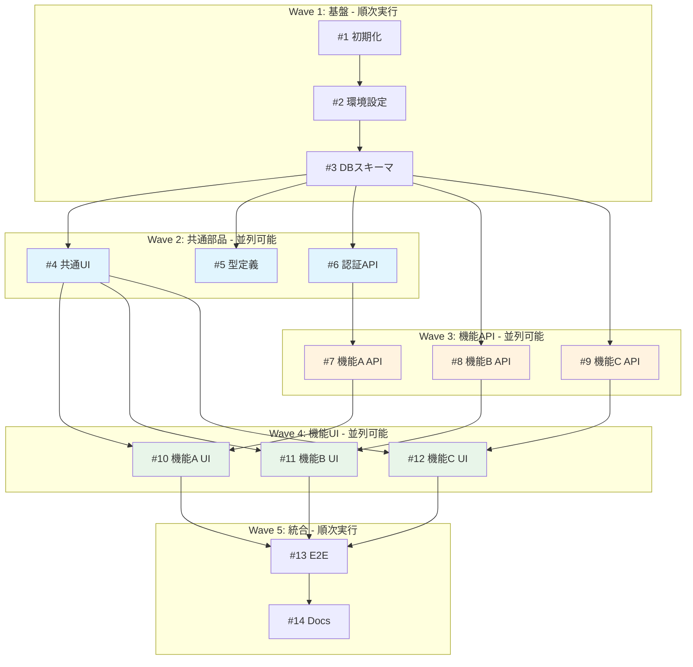

設計ドキュメントをもとに、実装に必要なIssueを洗い出します。
**並列開発を考慮**し、複数のClaude Codeウィンドウで同時に進められるよう設計します。

## 参照
@docs/requirements.md
@docs/architecture.md
@docs/database-schema.md
@docs/api-spec.md

## 手順

### 1. 設計ドキュメントの分析
- requirements.mdの機能要件（MVP）を確認
- architecture.mdのコンポーネント構成を確認
- database-schema.mdのテーブル定義を確認
- api-spec.mdのエンドポイント一覧を確認

### 2. Issue分解の原則

#### 粒度の目安
- 1 Issueは1〜4時間程度で完了できる作業量
- 1 PRで完結できる範囲
- テスト可能な単位

#### 並列開発のための分離原則（重要）

**ファイル競合を避けるため、以下を徹底する：**

1. **Feature単位で分離**: 異なるfeatureフォルダを編集するIssueは並列可能
   - `features/auth/` と `features/users/` は別々のIssueに
   - 共通コンポーネント（`components/ui/`）は先に完了させる

2. **レイヤー単位で分離**: 同一機能でもAPI/UIで分ける
   - `[機能名] API実装` と `[機能名] UI実装` を別Issueに
   - APIが先に完了していればUIは並列可能

3. **共有リソースは先に完了**:
   - 共通コンポーネント、型定義、ユーティリティ
   - DB スキーマ、マイグレーション
   - これらは「ブロッカーIssue」として最初に完了

4. **1Issue = 1ディレクトリ原則**:
   - 可能な限り、編集対象を1つのディレクトリに限定
   - 複数ディレクトリにまたがる場合は依存関係を明示

#### Issue種別
- `infra`: 環境構築、CI/CD、設定
- `db`: データベース関連（マイグレーション、モデル）
- `api`: APIエンドポイント実装
- `ui`: フロントエンド画面・コンポーネント
- `feature`: 機能実装（API + UI統合）
- `test`: テスト追加
- `docs`: ドキュメント

### 3. 推奨並列数

Claude Code Maxプランの使用量を考慮した推奨：

| プラン | 推奨並列数 | 備考 |
|-------|-----------|------|
| Max 5x | 2-3並列 | 5時間あたり50-200プロンプト |
| Max 20x | 3-5並列 | 5時間あたり200-800プロンプト |

**注意**: 並列数を増やすと使用量消費が加速します。
1エージェントでも全Issue実行可能な設計になっています。

## 出力形式

以下の形式で出力してください。人間が並列実行を割り振りやすいよう、明確に構造化します。

---

## Issue一覧

### Wave 1: 基盤構築（順次実行）

このWaveは依存関係の起点となるため、**1つのウィンドウで順番に実行**してください。

| # | タイトル | 種別 | 編集対象ディレクトリ | 概要 |
|---|---------|------|---------------------|------|
| 1 | [タイトル] | infra | [パス] | [概要] |
| 2 | [タイトル] | infra | [パス] | [概要] |
| 3 | [タイトル] | db | [パス] | [概要] |

**実行方法**: ウィンドウAで #1 → #2 → #3 を順に実行

---

### Wave 2: 共通部品（並列実行可能）

Wave 1完了後、以下は**同時に別ウィンドウで実行可能**です。

| # | タイトル | 種別 | 編集対象ディレクトリ | 依存 | ウィンドウ割当 |
|---|---------|------|---------------------|------|---------------|
| 4 | [タイトル] | ui | components/ui/ | #1-3 | **A** |
| 5 | [タイトル] | infra | types/, lib/ | #1-3 | **B** |
| 6 | [タイトル] | api | features/auth/ | #3 | **C** |

**実行方法**:
- ウィンドウA: #4 を実行
- ウィンドウB: #5 を実行
- ウィンドウC: #6 を実行（2並列の場合はAまたはBが完了後に実行）

---

### Wave 3: 機能API（並列実行可能）

Wave 2完了後、以下は**同時に別ウィンドウで実行可能**です。

| # | タイトル | 種別 | 編集対象ディレクトリ | 依存 | ウィンドウ割当 |
|---|---------|------|---------------------|------|---------------|
| 7 | [タイトル] | api | features/featureA/ | #6 | **A** |
| 8 | [タイトル] | api | features/featureB/ | #3 | **B** |
| 9 | [タイトル] | api | features/featureC/ | #3 | **C** |

**実行方法**:
- ウィンドウA: #7 を実行
- ウィンドウB: #8 を実行
- ウィンドウC: #9 を実行

---

### Wave 4: 機能UI（並列実行可能）

対応するAPIが完了したものから**並列実行可能**です。

| # | タイトル | 種別 | 編集対象ディレクトリ | 依存 | ウィンドウ割当 |
|---|---------|------|---------------------|------|---------------|
| 10 | [タイトル] | ui | features/featureA/ | #4,#7 | **A** |
| 11 | [タイトル] | ui | features/featureB/ | #4,#8 | **B** |
| 12 | [タイトル] | ui | features/featureC/ | #4,#9 | **C** |

**実行方法**:
- ウィンドウA: #7完了後、#10 を実行
- ウィンドウB: #8完了後、#11 を実行
- ウィンドウC: #9完了後、#12 を実行

---

### Wave 5: 統合・仕上げ（順次実行）

全機能完了後、**1つのウィンドウで順番に実行**してください。

| # | タイトル | 種別 | 編集対象ディレクトリ | 依存 |
|---|---------|------|---------------------|------|
| 13 | E2Eテスト | test | tests/e2e/ | #10-12 |
| 14 | ドキュメント整備 | docs | docs/ | #13 |

---

## 並列実行ガイド

### ウィンドウ別タスク割当表

以下をコピーして、各ウィンドウに貼り付けて実行してください。

#### 1並列（シンプル）
```
【ウィンドウA】
#1 → #2 → #3 → #4 → #5 → #6 → #7 → #8 → #9 → #10 → #11 → #12 → #13 → #14
```

#### 2並列（Max 5x推奨）
```
【ウィンドウA - メインライン】
#1 → #2 → #3 → #4 → #7 → #10 → #13 → #14

【ウィンドウB - サブライン】
（Wave1完了を待機）→ #5 → #6 → #8 → #9 → #11 → #12
```

#### 3並列（Max 20x推奨）
```
【ウィンドウA - 機能A担当】
#1 → #2 → #3 → #4 → #7 → #10

【ウィンドウB - 機能B担当】
（Wave1完了を待機）→ #5 → #8 → #11 → #13

【ウィンドウC - 機能C担当】
（Wave1完了を待機）→ #6 → #9 → #12 → #14
```

### 各ウィンドウへの指示テンプレート

新しいClaude Codeウィンドウを開いたら、以下を貼り付けてください：

```
このプロジェクトで Issue #[番号] を実装してください。
/issue [番号] で内容を確認し、/research → /plan → /test → /impl の流れで進めてください。
```

---

## 依存関係図



凡例:
- 青: Wave 2（共通部品）
- オレンジ: Wave 3（機能API）
- 緑: Wave 4（機能UI）

---

## 並列開発時の注意事項

1. **ブランチ戦略**: 各Issueは `feature/#番号-概要` ブランチで作業
2. **マージ順序**: Wave番号順にマージ（依存関係を維持）
3. **コンフリクト発生時**: 先にマージされた方を優先、後続は `git pull --rebase origin main`
4. **待機タイミング**: 「Wave1完了を待機」と書かれている場合、mainブランチに#3がマージされるまで待つ

---

## 次のステップ

1. 上記Issue一覧を確認し、粒度を調整（必要に応じて分割・統合）
2. 並列数を決定（1並列/2並列/3並列）
3. 「ウィンドウ別タスク割当表」をメモ
4. `/new-issue [タイトル]` でIssue作成を開始
5. 各ウィンドウで割り当てられたIssueを順番に実行

各Issueの詳細な実装内容は `/new-issue` 実行時に記述します。
